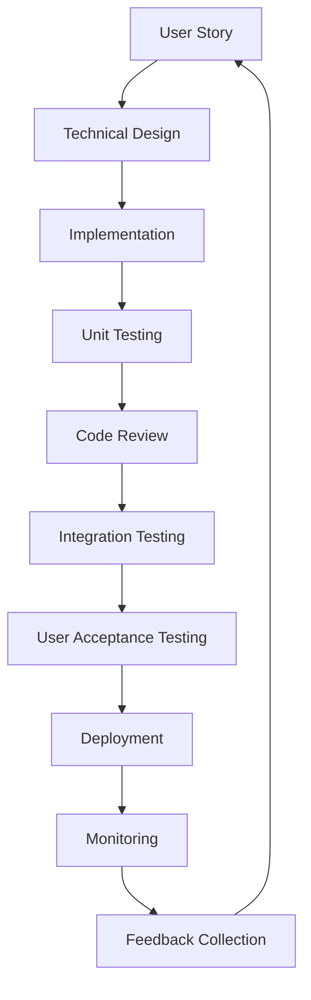
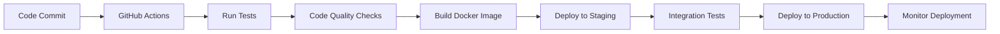

# ADDIS Development Methodology
## Software Engineering Practices and Project Management

**Author:** Shardae Douglas  
**Date:** September 2025  
**Version:** 1.0

---

## Table of Contents

1. [Development Philosophy](#1-development-philosophy)
2. [Project Management Approach](#2-project-management-approach)
3. [Software Development Lifecycle](#3-software-development-lifecycle)
4. [Code Quality Standards](#4-code-quality-standards)
5. [Testing Strategy](#5-testing-strategy)
6. [Documentation Standards](#6-documentation-standards)
7. [Version Control Strategy](#7-version-control-strategy)
8. [Deployment Pipeline](#8-deployment-pipeline)

## 1. Development Philosophy

### 1.1 Core Principles

**ADDIS Development Philosophy:**

1. **User-Centric Design:** Every feature is designed with the end user in mind
2. **Scientific Rigor:** All algorithms and methodologies are scientifically validated
3. **Open Source Mindset:** Code is designed for transparency and collaboration
4. **Iterative Development:** Continuous improvement through rapid prototyping
5. **Quality First:** Code quality is prioritized over speed of delivery

### 1.2 Agile Methodology

ADDIS follows an **Agile-inspired development approach** with the following characteristics:

- **Sprint-based Development:** 2-week development cycles
- **User Story Driven:** Features defined as user stories
- **Continuous Integration:** Automated testing and deployment
- **Regular Reviews:** Weekly progress reviews and retrospectives
- **Adaptive Planning:** Flexible planning based on user feedback

### 1.3 Development Team Structure

**Roles and Responsibilities:**

- **Lead Developer:** Architecture decisions, code review, technical leadership
- **Data Scientist:** Algorithm development, statistical validation
- **Frontend Developer:** User interface design and implementation
- **DevOps Engineer:** Infrastructure, deployment, monitoring
- **Quality Assurance:** Testing, validation, user acceptance testing

## 2. Project Management Approach

### 2.1 Project Phases

#### Phase 1: Foundation (Weeks 1-4)
- **Requirements Analysis:** User needs and system requirements
- **Architecture Design:** System architecture and technology stack
- **Proof of Concept:** Core algorithm validation
- **Project Setup:** Development environment and tooling

#### Phase 2: Core Development (Weeks 5-12)
- **Backend Development:** Core API and data processing modules
- **Frontend Development:** User interface and user experience
- **Integration:** System integration and testing
- **Documentation:** Technical and user documentation

#### Phase 3: Enhancement (Weeks 13-16)
- **Feature Enhancement:** Additional features and improvements
- **Performance Optimization:** System performance tuning
- **User Testing:** Beta testing and user feedback
- **Bug Fixes:** Issue resolution and stability improvements

#### Phase 4: Deployment (Weeks 17-20)
- **Production Deployment:** Live system deployment
- **Monitoring Setup:** Performance and error monitoring
- **User Training:** Documentation and training materials
- **Maintenance Planning:** Long-term maintenance strategy

### 2.2 User Story Framework

**User Story Template:**
```
As a [user type]
I want [functionality]
So that [benefit/value]

Acceptance Criteria:
- [ ] Criterion 1
- [ ] Criterion 2
- [ ] Criterion 3
```

**Example User Stories:**

1. **Station Search:**
   ```
   As a meteorologist
   I want to search for weather stations by name or location
   So that I can quickly find relevant stations for my analysis
   
   Acceptance Criteria:
   - [ ] Search returns results within 2 seconds
   - [ ] Search supports partial name matching
   - [ ] Results show station location and data availability
   ```

2. **Anomaly Detection:**
   ```
   As a climate researcher
   I want to detect weather anomalies across multiple elements
   So that I can identify unusual weather patterns
   
   Acceptance Criteria:
   - [ ] System analyzes all available weather elements
   - [ ] Results include statistical explanations
   - [ ] Analysis completes within 30 seconds
   ```

### 2.3 Task Management

#### 2.3.1 Task Prioritization
**Priority Levels:**
- **P0 (Critical):** System-breaking bugs, security issues
- **P1 (High):** Core functionality, user-blocking issues
- **P2 (Medium):** Important features, performance improvements
- **P3 (Low):** Nice-to-have features, minor improvements

#### 2.3.2 Task Estimation
**Story Points Scale:**
- **1 Point:** Simple bug fix, minor change
- **2 Points:** Small feature, straightforward implementation
- **3 Points:** Medium feature, moderate complexity
- **5 Points:** Large feature, significant complexity
- **8 Points:** Very large feature, high complexity

## 3. Software Development Lifecycle

### 3.1 Development Workflow



### 3.2 Development Process

#### 3.2.1 Feature Development Process

1. **Story Creation:**
   - User story written with acceptance criteria
   - Technical requirements identified
   - Story points estimated

2. **Technical Design:**
   - Architecture review
   - API design
   - Database schema updates
   - Security considerations

3. **Implementation:**
   - Feature branch creation
   - Code implementation
   - Unit test writing
   - Documentation updates

4. **Code Review:**
   - Peer review process
   - Code quality checks
   - Security review
   - Performance review

5. **Testing:**
   - Unit test execution
   - Integration testing
   - User acceptance testing
   - Performance testing

6. **Deployment:**
   - Staging deployment
   - Production deployment
   - Monitoring setup
   - User notification

### 3.3 Quality Gates

**Definition of Done:**
- [ ] Code implemented according to design
- [ ] Unit tests written and passing
- [ ] Code reviewed and approved
- [ ] Integration tests passing
- [ ] Documentation updated
- [ ] Security review completed
- [ ] Performance requirements met
- [ ] User acceptance criteria satisfied

## 4. Code Quality Standards

### 4.1 Coding Standards

#### 4.1.1 Python Code Style
**PEP 8 Compliance:**
```python
# Function naming
def calculate_station_baseline(station_data, target_date):
    """Calculate baseline statistics for a station and date.
    
    Args:
        station_data (pd.DataFrame): Historical weather data
        target_date (datetime): Target date for baseline calculation
        
    Returns:
        dict: Baseline statistics or None if insufficient data
    """
    # Implementation here
    pass

# Class naming
class ComprehensiveAnomalyDetector:
    """Comprehensive anomaly detection system."""
    
    def __init__(self):
        """Initialize the detector."""
        self.weather_elements = {}
    
    def detect_anomalies(self, data, station_id, start_date, end_date):
        """Detect anomalies in weather data."""
        pass
```

#### 4.1.2 JavaScript Code Style
**ES6+ Standards:**
```javascript
// Function naming
async function fetchStationData(stationId) {
    try {
        const response = await fetch(`/api/stations/${stationId}/fetch`);
        const data = await response.json();
        return data;
    } catch (error) {
        console.error('Error fetching station data:', error);
        throw error;
    }
}

// Class naming
class StationManager {
    constructor() {
        this.stations = [];
        this.cache = new Map();
    }
    
    async loadStations() {
        // Implementation here
    }
}
```

### 4.2 Code Review Process

#### 4.2.1 Review Checklist
- [ ] **Functionality:** Does the code work as intended?
- [ ] **Readability:** Is the code easy to understand?
- [ ] **Performance:** Are there any performance issues?
- [ ] **Security:** Are there any security vulnerabilities?
- [ ] **Testing:** Are there adequate tests?
- [ ] **Documentation:** Is the code properly documented?

#### 4.2.2 Review Process
1. **Author:** Creates pull request with description
2. **Reviewer:** Reviews code against checklist
3. **Discussion:** Comments and suggestions
4. **Approval:** Reviewer approves or requests changes
5. **Merge:** Code merged after approval

### 4.3 Static Code Analysis

#### 4.3.1 Python Tools
```bash
# Code formatting
black *.py

# Linting
flake8 *.py

# Type checking
mypy *.py

# Security scanning
bandit -r .
```

#### 4.3.2 JavaScript Tools
```bash
# Code formatting
prettier --write *.js

# Linting
eslint *.js

# Type checking
tsc --noEmit
```

## 5. Testing Strategy

### 5.1 Testing Pyramid

```
        /\
       /  \
      / E2E \     <- End-to-End Tests (Few)
     /______\
    /        \
   /Integration\ <- Integration Tests (Some)
  /____________\
 /              \
/   Unit Tests   \ <- Unit Tests (Many)
/________________\
```

### 5.2 Unit Testing

#### 5.2.1 Test Structure
```python
import pytest
import pandas as pd
from datetime import datetime
from comprehensive_anomaly_detector import ComprehensiveAnomalyDetector

class TestComprehensiveAnomalyDetector:
    """Test suite for ComprehensiveAnomalyDetector."""
    
    def setup_method(self):
        """Set up test fixtures."""
        self.detector = ComprehensiveAnomalyDetector()
        self.sample_data = self._create_sample_data()
    
    def _create_sample_data(self):
        """Create sample weather data for testing."""
        dates = pd.date_range('2023-01-01', periods=365, freq='D')
        return pd.DataFrame({
            'STATION': ['USC00086700'] * 365,
            'DATE': dates,
            'TMAX_F': [75.0] * 365,
            'TMIN_F': [55.0] * 365,
            'PRCP_IN': [0.1] * 365
        })
    
    def test_detect_anomalies_temperature(self):
        """Test temperature anomaly detection."""
        # Test implementation
        pass
    
    def test_detect_anomalies_precipitation(self):
        """Test precipitation anomaly detection."""
        # Test implementation
        pass
    
    def test_baseline_calculation(self):
        """Test baseline calculation."""
        # Test implementation
        pass
```

#### 5.2.2 Test Coverage Requirements
- **Minimum Coverage:** 80% line coverage
- **Critical Paths:** 100% coverage for core algorithms
- **Edge Cases:** Comprehensive edge case testing
- **Error Handling:** All error conditions tested

### 5.3 Integration Testing

#### 5.3.1 API Testing
```python
import requests
import pytest

class TestAPIEndpoints:
    """Test suite for API endpoints."""
    
    @pytest.fixture
    def base_url(self):
        """Base URL for API testing."""
        return "http://localhost:5001"
    
    def test_station_search(self, base_url):
        """Test station search endpoint."""
        response = requests.get(f"{base_url}/api/stations/search?q=miami")
        assert response.status_code == 200
        data = response.json()
        assert 'stations' in data
        assert len(data['stations']) > 0
    
    def test_anomaly_detection(self, base_url):
        """Test anomaly detection endpoint."""
        payload = {
            'station_id': 'USC00086700',
            'start_date': '2023-01-01',
            'end_date': '2023-12-31',
            'confidence_threshold': 1.0
        }
        response = requests.post(f"{base_url}/api/comprehensive-anomaly-detection", json=payload)
        assert response.status_code == 200
        data = response.json()
        assert 'summary' in data
        assert 'anomalies' in data
```

### 5.4 End-to-End Testing

#### 5.4.1 User Journey Testing
```python
from selenium import webdriver
from selenium.webdriver.common.by import By
import time

class TestUserJourney:
    """End-to-end user journey testing."""
    
    def setup_method(self):
        """Set up browser for testing."""
        self.driver = webdriver.Chrome()
        self.driver.get("http://localhost:5001")
    
    def teardown_method(self):
        """Clean up after test."""
        self.driver.quit()
    
    def test_complete_analysis_workflow(self):
        """Test complete user analysis workflow."""
        # Search for station
        search_box = self.driver.find_element(By.ID, "stationSearch")
        search_box.send_keys("miami")
        time.sleep(2)
        
        # Select station
        station_select = self.driver.find_element(By.ID, "stationSelect")
        station_select.click()
        time.sleep(1)
        
        # Set date range
        start_date = self.driver.find_element(By.ID, "startDate")
        start_date.send_keys("2023-01-01")
        
        end_date = self.driver.find_element(By.ID, "endDate")
        end_date.send_keys("2023-12-31")
        
        # Run analysis
        run_button = self.driver.find_element(By.ID, "runAnalysis")
        run_button.click()
        
        # Wait for results
        time.sleep(10)
        
        # Verify results
        results_section = self.driver.find_element(By.ID, "resultsSection")
        assert results_section.is_displayed()
```

## 6. Documentation Standards

### 6.1 Documentation Types

#### 6.1.1 Technical Documentation
- **API Documentation:** OpenAPI/Swagger specifications
- **Code Documentation:** Inline comments and docstrings
- **Architecture Documentation:** System design and components
- **Deployment Documentation:** Setup and configuration guides

#### 6.1.2 User Documentation
- **User Guide:** Step-by-step usage instructions
- **FAQ:** Frequently asked questions
- **Tutorials:** Learning materials and examples
- **Release Notes:** Feature updates and changes

### 6.2 Documentation Standards

#### 6.2.1 Code Documentation
```python
def calculate_station_baseline(station_data, target_date):
    """Calculate baseline statistics for a specific station and date.
    
    This function calculates statistical baselines for weather elements
    by analyzing historical data within a 30-day window around the
    target date. The baseline is used for anomaly detection.
    
    Args:
        station_data (pd.DataFrame): Historical weather data containing
            columns: STATION, DATE, and weather element columns
        target_date (datetime): Target date for baseline calculation.
            The baseline will be calculated using data from 30 days
            before and after this date.
    
    Returns:
        dict or None: Dictionary containing baseline statistics:
            - mean (float): Mean value for each weather element
            - std (float): Standard deviation for each element
            - sample_size (int): Number of observations used
            - min (float): Minimum value observed
            - max (float): Maximum value observed
            - percentile_25 (float): 25th percentile
            - percentile_75 (float): 75th percentile
        Returns None if insufficient data (< 5 observations)
    
    Raises:
        ValueError: If target_date is not a valid datetime
        KeyError: If required columns are missing from station_data
    
    Example:
        >>> data = pd.DataFrame({
        ...     'STATION': ['USC00086700'] * 100,
        ...     'DATE': pd.date_range('2023-01-01', periods=100),
        ...     'TMAX_F': [75.0] * 100
        ... })
        >>> baseline = calculate_station_baseline(data, datetime(2023, 6, 15))
        >>> print(baseline['mean']['TMAX_F'])
        75.0
    """
    # Implementation here
    pass
```

#### 6.2.2 API Documentation
```yaml
openapi: 3.0.0
info:
  title: ADDIS API
  version: 1.0.0
  description: AI-Powered Data Discrepancy Identification System API

paths:
  /api/stations/search:
    get:
      summary: Search for weather stations
      parameters:
        - name: q
          in: query
          required: true
          schema:
            type: string
          description: Search query (station name, ID, or location)
        - name: country
          in: query
          schema:
            type: string
            default: US
          description: Country code filter
        - name: limit
          in: query
          schema:
            type: integer
            default: 20
          description: Maximum number of results
      responses:
        '200':
          description: Successful search
          content:
            application/json:
              schema:
                type: object
                properties:
                  stations:
                    type: array
                    items:
                      $ref: '#/components/schemas/Station'
```

## 7. Version Control Strategy

### 7.1 Git Workflow

#### 7.1.1 Branch Strategy
```
main
├── develop
│   ├── feature/station-search
│   ├── feature/anomaly-detection
│   └── feature/user-interface
├── release/v1.0.0
└── hotfix/critical-bug-fix
```

#### 7.1.2 Branch Naming Conventions
- **Feature branches:** `feature/description-of-feature`
- **Bug fix branches:** `bugfix/description-of-bug`
- **Hotfix branches:** `hotfix/description-of-hotfix`
- **Release branches:** `release/v1.0.0`

### 7.2 Commit Standards

#### 7.2.1 Commit Message Format
```
<type>(<scope>): <description>

[optional body]

[optional footer(s)]
```

**Types:**
- `feat`: New feature
- `fix`: Bug fix
- `docs`: Documentation changes
- `style`: Code style changes
- `refactor`: Code refactoring
- `test`: Test additions or changes
- `chore`: Build process or auxiliary tool changes

**Examples:**
```
feat(api): add comprehensive anomaly detection endpoint

Add new API endpoint for detecting anomalies across all weather elements.
Includes statistical analysis and machine learning approaches.

Closes #123
```

### 7.3 Release Management

#### 7.3.1 Semantic Versioning
**Format:** `MAJOR.MINOR.PATCH`

- **MAJOR:** Breaking changes
- **MINOR:** New features (backward compatible)
- **PATCH:** Bug fixes (backward compatible)

**Examples:**
- `1.0.0`: Initial release
- `1.1.0`: Added new features
- `1.1.1`: Bug fixes
- `2.0.0`: Breaking changes

#### 7.3.2 Release Process
1. **Feature Complete:** All features for release completed
2. **Testing:** Comprehensive testing completed
3. **Documentation:** Release notes and documentation updated
4. **Release Branch:** Create release branch from develop
5. **Final Testing:** Final testing on release branch
6. **Release:** Merge to main and tag version
7. **Deploy:** Deploy to production
8. **Monitor:** Monitor production deployment

## 8. Deployment Pipeline

### 8.1 CI/CD Pipeline



### 8.2 GitHub Actions Workflow

```yaml
name: CI/CD Pipeline

on:
  push:
    branches: [ main, develop ]
  pull_request:
    branches: [ main ]

jobs:
  test:
    runs-on: ubuntu-latest
    
    steps:
    - uses: actions/checkout@v3
    
    - name: Set up Python
      uses: actions/setup-python@v4
      with:
        python-version: '3.13'
    
    - name: Install dependencies
      run: |
        pip install -r requirements.txt
        pip install pytest pytest-cov
    
    - name: Run tests
      run: |
        pytest --cov=. --cov-report=xml
    
    - name: Upload coverage
      uses: codecov/codecov-action@v3
    
    - name: Run linting
      run: |
        flake8 .
        black --check .
    
    - name: Run security scan
      run: |
        bandit -r .

  build:
    needs: test
    runs-on: ubuntu-latest
    
    steps:
    - uses: actions/checkout@v3
    
    - name: Build Docker image
      run: |
        docker build -t addis:${{ github.sha }} .
    
    - name: Push to registry
      run: |
        echo ${{ secrets.DOCKER_PASSWORD }} | docker login -u ${{ secrets.DOCKER_USERNAME }} --password-stdin
        docker push addis:${{ github.sha }}

  deploy:
    needs: build
    runs-on: ubuntu-latest
    if: github.ref == 'refs/heads/main'
    
    steps:
    - name: Deploy to production
      run: |
        # Deployment commands here
        echo "Deploying to production..."
```

### 8.3 Environment Management

#### 8.3.1 Environment Configuration
```python
# config.py
import os

class Config:
    """Base configuration."""
    SECRET_KEY = os.environ.get('SECRET_KEY') or 'dev-secret-key'
    DEBUG = False
    TESTING = False

class DevelopmentConfig(Config):
    """Development configuration."""
    DEBUG = True
    NCEI_API_TOKEN = os.environ.get('NCEI_API_TOKEN')

class ProductionConfig(Config):
    """Production configuration."""
    SECRET_KEY = os.environ.get('SECRET_KEY')
    NCEI_API_TOKEN = os.environ.get('NCEI_API_TOKEN')

class TestingConfig(Config):
    """Testing configuration."""
    TESTING = True
    NCEI_API_TOKEN = 'test-token'

config = {
    'development': DevelopmentConfig,
    'production': ProductionConfig,
    'testing': TestingConfig,
    'default': DevelopmentConfig
}
```

### 8.4 Monitoring and Logging

#### 8.4.1 Application Monitoring
```python
import logging
from datetime import datetime

# Configure logging
logging.basicConfig(
    level=logging.INFO,
    format='%(asctime)s - %(name)s - %(levelname)s - %(message)s',
    handlers=[
        logging.FileHandler('addis.log'),
        logging.StreamHandler()
    ]
)

logger = logging.getLogger(__name__)

# Performance monitoring
import time
from functools import wraps

def monitor_performance(func):
    """Decorator to monitor function performance."""
    @wraps(func)
    def wrapper(*args, **kwargs):
        start_time = time.time()
        result = func(*args, **kwargs)
        end_time = time.time()
        
        logger.info(f"{func.__name__} executed in {end_time - start_time:.2f} seconds")
        return result
    
    return wrapper
```

#### 8.4.2 Health Checks
```python
@app.route('/health')
def health_check():
    """Health check endpoint."""
    try:
        # Check database connection
        # Check external API availability
        # Check system resources
        
        return jsonify({
            'status': 'healthy',
            'timestamp': datetime.now().isoformat(),
            'version': '1.0.0'
        })
    except Exception as e:
        return jsonify({
            'status': 'unhealthy',
            'error': str(e),
            'timestamp': datetime.now().isoformat()
        }), 500
```

---

**Document Classification:** Development Methodology  
**Review Status:** Draft  
**Next Review Date:** December 2025
